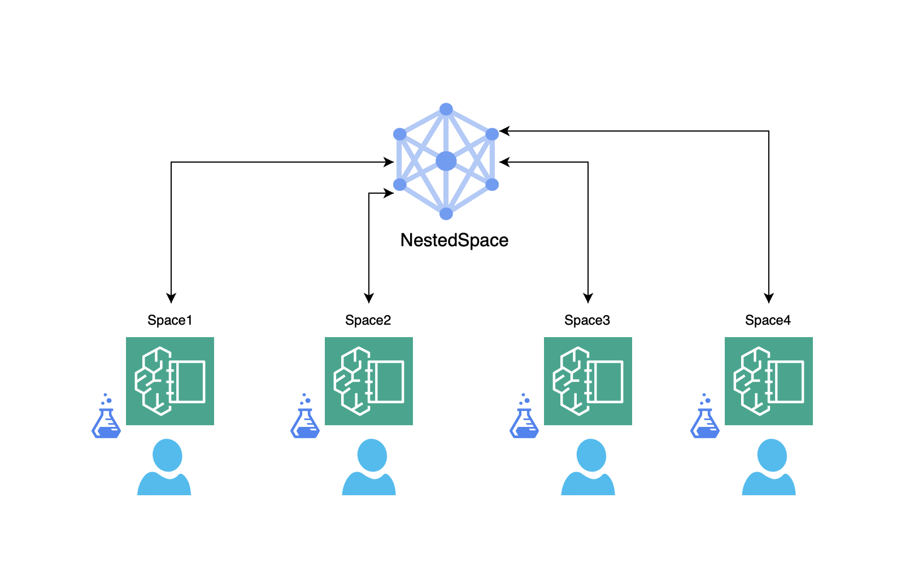

# NestedSpace
Track your ML experiments, data and other artifacts with minimal overhead and configs. A light, easy Experiment tracking framework

Data science is inherently experimental, involving hundreds or thousands of experiments to refine models and improve outcomes. However, tracking these experiments presents a significant challenge, as many practitioners rely on inefficient methods like CSV files or documents. This lack of effective tracking can hinder reproducibility and transparency in data science workflows.
To address these issues, various tools have emerged for this, Notable options include:- Weights and Biases, CometML, MLFlow, DVC (Data Version Control), Kubeflow Pipelines etc
While these tools offer robust functionalities, they often require setups involving databases or servers, usage of api's, custom dashboards, integration complexitites, infrastructure maintainence, and they can be time-consuming to learn. These can deter users who seek straightforward, simple and easy-to-go solutions for managing their experiments and labs
There is a clear demand for a tool/framework that is user-friendly, compatible with Jupyter notebooks, and capable of efficiently tracking experiments without the overhead of extensive setup or learning. The ideal solution would simplify the experiment tracking process while maintaining the necessary features for effective data science practice.

All you need is **NestedSpace**
